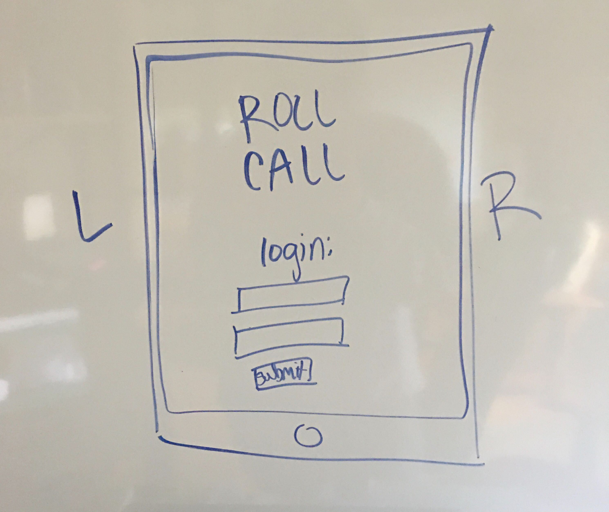
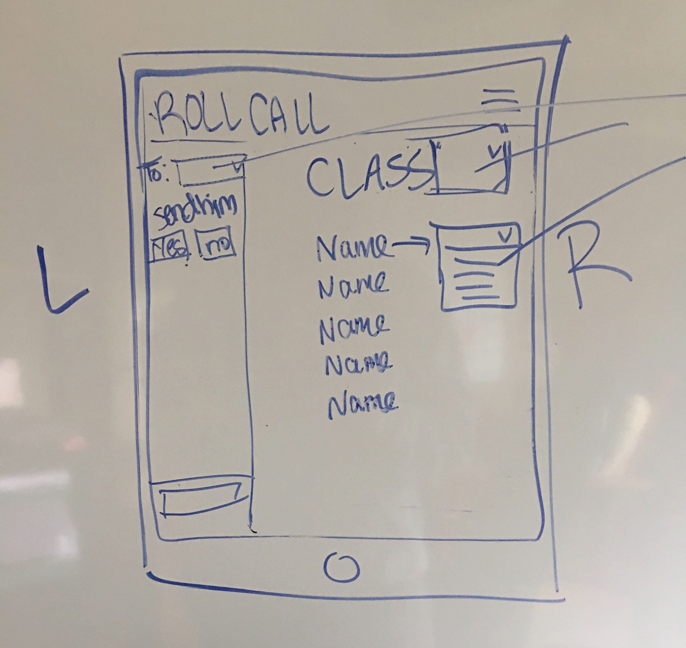
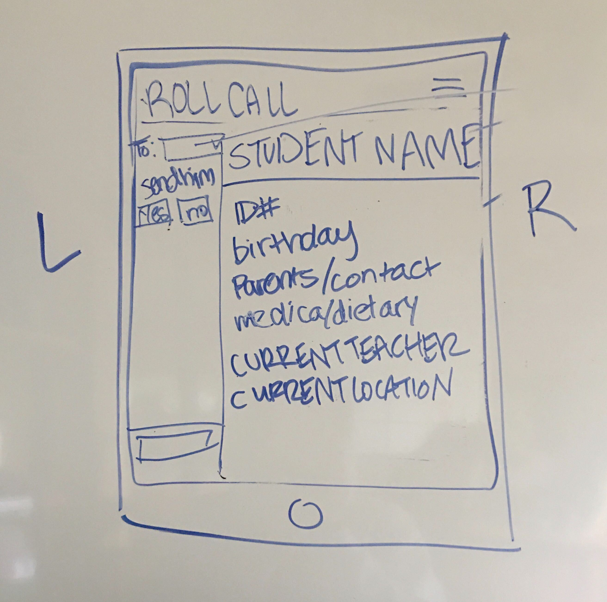

# UPDATE 4/6

## Layout
We met and mocked up the layouts for our 3 basic pages:

### The login page
The login/splash page (just a logo, email and password inputs and a submit button)

### Components
Logo component
Login component

### The class page
where the teacher/user can change the status of the whole class or an individual student using dropdown menus.

There will also be a chat window kinda thing on the left (using socket.io) for real-time communication between teachers. We hope to be able to send prompts in the chat, to which teachers can click "yes" or "no".

### Components
Navbar component
Class component
Student component
Chat (socket.io) component

### The student page
where the teacher/user can view the following data about that student from the student database:
 1. name
 2. ID
 3. birthday
 4. parents' names
 5. parents' contact info
 6. medical/dietary/behavioral info
 7. the teacher currently responsible for that student (from teacher table)
 8. student's current location

### Components
Navbar component
Chat (socket.io) component
Student component

## Data Structure
We will use MongoDB and Mongoose for our database. We will have 3 tables: teachers, students and transfer log

The teacher table will have the following info for each teacher/user:
 1. ID
 2. name

The student table wil have the following for each student:
 1. name
 2. ID
 3. birthday
 4. parents' names
 5. parents' contact info
 6. medical/dietary/behavioral info
 7. the teacher currently responsible for that student (an ID from the teacher table)
 8. student's current location

The transfer log table will store information about any changes to the student table. If a teacher signs a student over to a different teacher, that transfer will be logged with:
1. a teacher ID (who made the change)
2. a student ID (which student was changed)
3. a teacher ID (who received the student)
*Changes made to an entire class at one time will log each student individually
4. CreatedAt (time transfer was made)

## Routes
We also established that we will need the following api routes:

1. GET list of all students assigned to the user
2. GET list of all teachers (from teachers database)
3. GET all data for a particular student
4. PUT a new status and/or location into student database
5. POST changes to transfer log table

## Project Requirements
Must use ReactJS in some way (even if minimal)
Must use a Node and Express Web Server
Must be backed by a MySQL or MongoDB Database with a Sequelize or Mongoose ORM  
Must have both GET and POST routes for retrieving and adding new data
Must be deployed using Heroku (with Data)
Must utilize at least two libraries, packages, or technologies that we haven't discussed
Must allow for or involve the authentication of users in some way
Must have a polished frontend/UI 
Must have folder structure that meets MVC Paradigm
Must meet good quality coding standards (indentation, scoping, naming)
Must not expose sensitive API key information on the server
Must use ReactJS in some way (even if minimal)
Must use a Node and Express Web Server
Must be backed by a MySQL or MongoDB Database with a Sequelize or Mongoose ORM  
Must have both GET and POST routes for retrieving and adding new data
Must be deployed using Heroku (with Data)
Must utilize at least two libraries, packages, or technologies that we haven't discussed
Must allow for or involve the authentication of users in some way
Must have a polished frontend/UI 
Must have folder structure that meets MVC Paradigm
Must meet good quality coding standards (indentation, scoping, naming)
Must not expose sensitive API key information on the server
